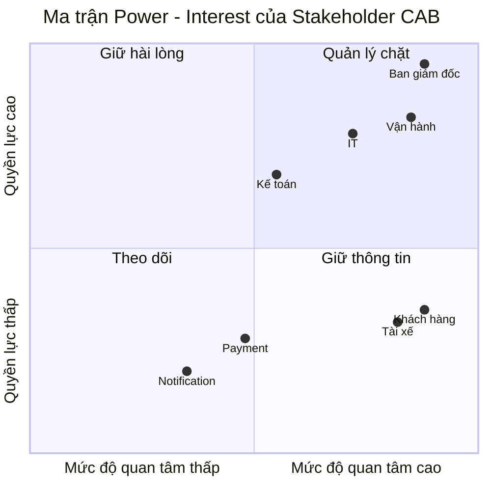
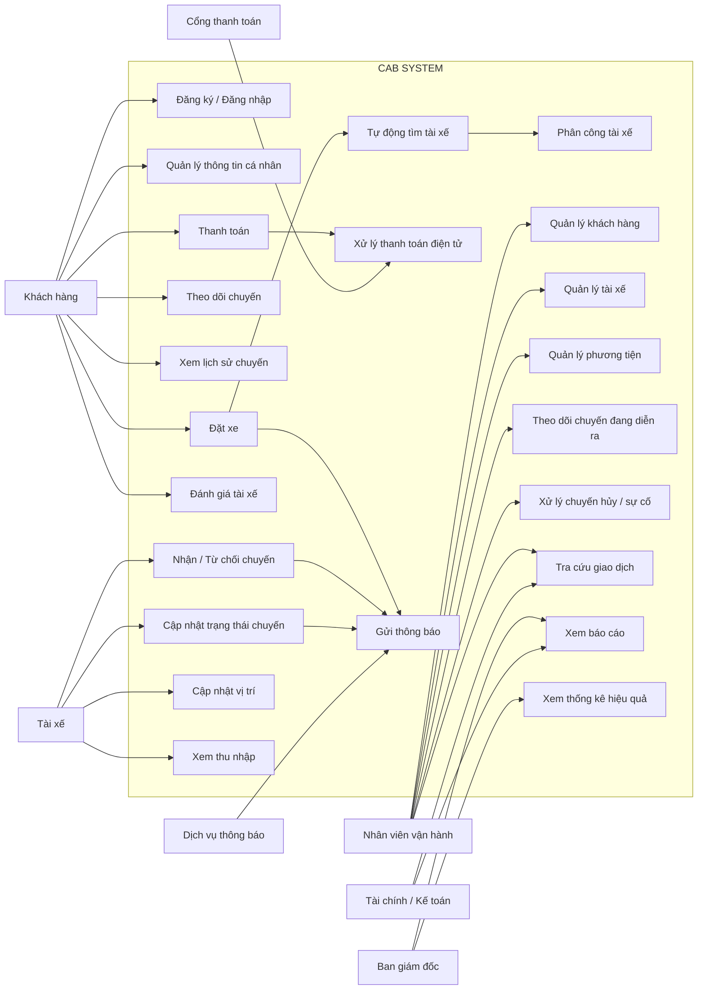
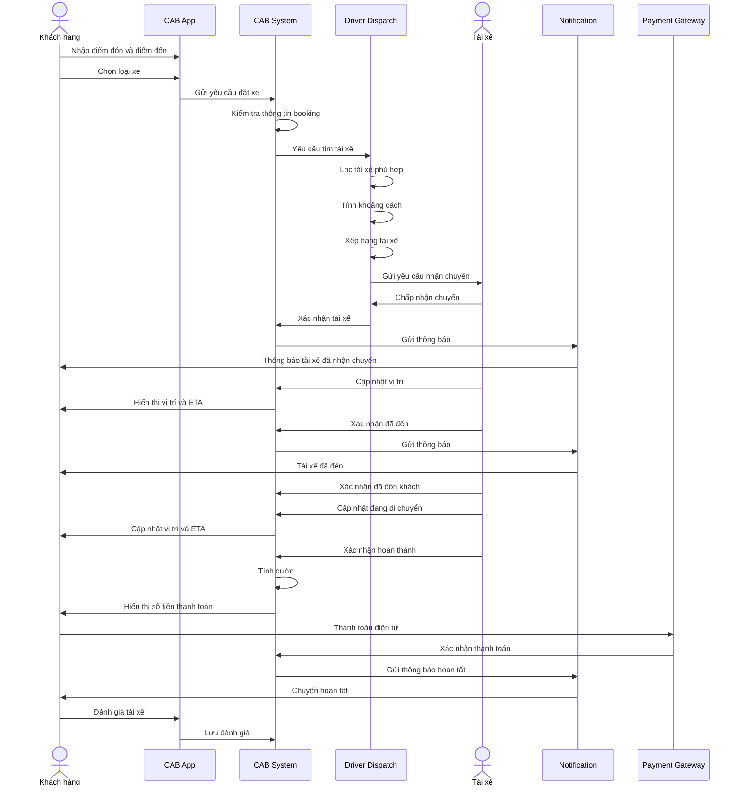

# 23638201_VoThiTrucVen_cabsystem
## 1. 
#### Vấn đề của hệ thống cũ
* Đặt xe còn thủ công.
* Phân công tài xế thủ công, mất thời gian.
* Khó theo dõi trạng thái và vị trí chuyến.
* Quản lý thanh toán chưa tập trung.
* Khó mở rộng khi số lượng người dùng tăng.
* Thông báo và xử lý sự cố còn hạn chế.
* Thiếu báo cáo, phân quyền và bảo mật.
  
#### Tại sao cần hệ thống mới?

* Hệ thống cũ còn nhiều thao tác **thủ công**, đặc biệt là phân công tài xế.
* Khó **theo dõi chuyến đi và quản lý thanh toán**.
* Khó đáp ứng khi **số lượng khách hàng và tài xế tăng**.
* Thiếu khả năng **quản lý, báo cáo và bảo mật**.

#### Hệ thống mới giúp ích gì?

* **Tự động tìm và phân công tài xế** → giảm thời gian vận hành.
* **Theo dõi chuyến theo thời gian thực** → khách hàng chủ động hơn.
* **Tập trung quản lý thanh toán và dữ liệu** → dễ kiểm soát, tra cứu.
* **Thông báo tự động** → tăng trải nghiệm khách hàng và tài xế.
* **Báo cáo, phân quyền** → hỗ trợ quản lý và ra quyết định.
* **Có khả năng mở rộng** → đáp ứng nhiều người dùng và dễ phát triển tính năng mới.

## 2.

| Stakeholder                 | Vai trò                                              | Tầm quan trọng |
| --------------------------- | ---------------------------------------------------- | -------------- |
| **Khách hàng**              | Đặt xe, theo dõi chuyến, thanh toán, đánh giá        | **Cao**        |
| **Tài xế**                  | Nhận và thực hiện chuyến, cập nhật trạng thái/vị trí | **Cao**        |
| **Nhân viên vận hành**      | Quản lý tài xế, khách hàng, chuyến đi và xử lý sự cố | **Cao**        |
| **Ban giám đốc**            | Định hướng, phê duyệt và theo dõi hiệu quả dự án     | **Cao**        |
| **Tài chính/Kế toán**       | Quản lý doanh thu, thanh toán và đối soát            | **Trung bình** |
| **IT/Đội phát triển**       | Xây dựng, triển khai và bảo trì hệ thống             | **Cao**        |
| **Nhà cung cấp thanh toán** | Xử lý thanh toán điện tử                             | **Trung bình** |
| **Nhà cung cấp thông báo**  | Cung cấp SMS/Email/Push Notification                 | **Trung bình** |

## 3.Mục đích nghiệp vụ của hệ thống CAB

* **Đáp ứng số lượng lớn khách hàng** và tài xế.
* **Tự động hóa việc phân công tài xế**, giảm thao tác thủ công.
* **Hỗ trợ nhiều phương thức thanh toán** như tiền mặt và thanh toán điện tử.
* **Nâng cao trải nghiệm khách hàng** thông qua theo dõi chuyến và thông báo.
* **Quản lý tập trung** khách hàng, tài xế, chuyến đi và giao dịch.
* **Tăng hiệu quả vận hành** và giảm thời gian xử lý.
* **Cung cấp báo cáo, thống kê** để hỗ trợ ra quyết định.
* **Đảm bảo hệ thống có khả năng mở rộng** và dễ bổ sung dịch vụ mới.
* **Tăng tính bảo mật và an toàn dữ liệu**.
  
## 4. Xác định phạm vi dự án trong 7 tuần

### Các module quan trọng để hệ thống CAB hoạt động

Có thể chia thành **8 module cốt lõi**:

| Module                     | Chức năng chính                               | 
| -------------------------- | --------------------------------------------- | 
| **1. User Management**     | Đăng ký, đăng nhập, quản lý khách hàng/tài xế | 
| **2. Booking & Trip**      | Tạo booking, quản lý trạng thái chuyến        | 
| **3. Driver & Vehicle**    | Quản lý tài xế, xe, trạng thái sẵn sàng       | 
| **4. Driver Dispatch**     | Tìm và phân công tài xế tự động               | 
| **5. Location & Tracking** | Vị trí tài xế, ETA, theo dõi chuyến           | 
| **6. Fare & Payment**      | Tính cước, tiền mặt/thanh toán điện tử        | 
| **7. Notification**        | Thông báo cho khách hàng và tài xế            | 
| **8. Admin/Ops**           | Quản lý và xử lý chuyến, tài xế, giao dịch    |

## 5. Yêu cầu nghiệp vụ (Business Requirements)

| ID       | Yêu cầu nghiệp vụ                                                                                     |
| -------- | ----------------------------------------------------------------------------------------------------- |
| **BR01** | Khách hàng có thể **đăng ký, đăng nhập và quản lý thông tin cá nhân**.                                |
| **BR02** | Khách hàng có thể **đặt xe**, nhập **điểm đón, điểm đến** và lựa chọn loại xe.                        |
| **BR03** | Hệ thống **tự động tìm và phân công tài xế phù hợp** dựa trên vị trí và trạng thái tài xế.            |
| **BR04** | Khách hàng được **thông báo** khi đặt xe thành công và khi tài xế nhận chuyến.                        |
| **BR05** | Khách hàng có thể **theo dõi chuyến đi**, vị trí tài xế và thời gian dự kiến đến.                     |
| **BR06** | Tài xế có thể **nhận/từ chối chuyến** và cập nhật trạng thái chuyến đi.                               |
| **BR07** | Sau khi chuyến hoàn thành, hệ thống **tính cước** và hiển thị số tiền khách hàng cần thanh toán.      |
| **BR08** | Khách hàng có thể **thanh toán bằng tiền mặt hoặc phương thức điện tử** theo chính sách doanh nghiệp. |
| **BR09** | Khách hàng có thể **xem lịch sử chuyến đi và giao dịch**.                                             |
| **BR10** | Khách hàng có thể **đánh giá tài xế sau khi hoàn thành chuyến**.                                      |
| **BR11** | Nhân viên vận hành có thể **quản lý khách hàng, tài xế, phương tiện và chuyến đi**.                   |
| **BR12** | Hệ thống cung cấp **báo cáo về số chuyến, doanh thu, tỷ lệ hoàn thành và hủy chuyến**.                |

### Luồng nghiệp vụ chính

**Đăng nhập → Nhập điểm đón/điểm đến → Đặt xe → Hệ thống tìm tài xế → Tài xế nhận → Theo dõi chuyến → Hoàn thành → Thanh toán → Đánh giá.**

## 6. Phân rã chức năng

### 1. Đặt xe

* Nhập điểm đón.
* Nhập điểm đến.
* Chọn loại xe.
* Xác nhận yêu cầu.
* Tạo chuyến đi.

### 2. Tìm tài xế

* Xác định vị trí khách hàng.
* Xác định bán kính tìm kiếm.
* Lập danh sách tài xế đang sẵn sàng.
* Kiểm tra loại xe phù hợp.
* Tính khoảng cách từ tài xế đến khách.
* Xếp hạng tài xế theo tiêu chí.
* Gửi yêu cầu cho tài xế.
* Chờ tài xế chấp nhận.
* Nếu từ chối/không phản hồi → tìm tài xế tiếp theo.
* Không có tài xế → thông báo khách hàng.

### 3. Thực hiện chuyến

* Tài xế xác nhận nhận chuyến.
* Theo dõi vị trí tài xế.
* Cập nhật: Đã đến → Đã đón khách → Đang di chuyển → Hoàn thành.
* Cập nhật ETA cho khách hàng.
* Gửi thông báo thay đổi trạng thái.

### 4. Tính cước & thanh toán

* Xác định loại dịch vụ.
* Tính khoảng cách/thời gian.
* Tính giá chuyến.
* Hiển thị số tiền cần trả.
* Thanh toán tiền mặt hoặc điện tử.
* Xử lý thanh toán thất bại.
* Lưu lịch sử giao dịch.

### 5. Sau chuyến

* Cập nhật chuyến hoàn thành.
* Gửi thông báo cho khách hàng.
* Khách hàng xem chi tiết/cước.
* Đánh giá tài xế.
* Lưu lịch sử chuyến.

### 6. Quản trị vận hành

* Quản lý khách hàng.
* Quản lý tài xế.
* Quản lý phương tiện.
* Theo dõi chuyến đang diễn ra.
* Xử lý chuyến lỗi/hủy.
* Tra cứu giao dịch.
* Xem báo cáo.
## 7. Use Case Diagram
Các actor chính
Khách hàng
Tài xế
Nhân viên vận hành
Ban giám đốc
Kế toán
Cổng thanh toán
Dịch vụ thông báo
7. Use Case Diagram
Các actor chính
Khách hàng
Tài xế
Nhân viên vận hành
Ban giám đốc
Kế toán
Cổng thanh toán
Dịch vụ thông báo

## 8. Đặc tả Use Case

### UC01 – Đặt xe

| Thuộc tính | Nội dung |
|---|---|
| **Tên Use Case** | Đặt xe |
| **Actor chính** | Khách hàng |
| **Mục tiêu** | Tạo yêu cầu đặt xe |
| **Tiền điều kiện** | Khách hàng đã đăng nhập |
| **Hậu điều kiện** | Booking được tạo và chuyển sang trạng thái chờ tìm tài xế |
| **Trigger** | Khách hàng chọn chức năng Đặt xe |

#### Luồng chính

1. Khách hàng chọn **Đặt xe**.
2. Hệ thống yêu cầu nhập điểm đón.
3. Khách hàng nhập điểm đón.
4. Hệ thống yêu cầu nhập điểm đến.
5. Khách hàng nhập điểm đến.
6. Khách hàng chọn loại xe.
7. Hệ thống kiểm tra thông tin.
8. Hệ thống tạo booking.
9. Hệ thống tìm tài xế phù hợp.
10. Hệ thống gửi yêu cầu đến tài xế.
11. Tài xế nhận chuyến.
12. Hệ thống cập nhật trạng thái booking.
13. Hệ thống thông báo cho khách hàng.

#### Luồng thay thế

**A1 – Thông tin không hợp lệ**

1. Hệ thống phát hiện điểm đón hoặc điểm đến không hợp lệ.
2. Hệ thống thông báo lỗi.
3. Khách hàng nhập lại thông tin.

**A2 – Không tìm thấy tài xế**

1. Hệ thống tìm kiếm trong phạm vi quy định.
2. Không tìm thấy tài xế phù hợp.
3. Hệ thống mở rộng phạm vi tìm kiếm.
4. Nếu vẫn không có tài xế, hệ thống thông báo cho khách hàng.
5. Booking chuyển sang trạng thái **Không tìm được tài xế**.
#### UC02 – Tìm và phân công tài xế

[↑ Quay lại Use Case Diagram](https://github.com/trucven708/23638201_VoThiTrucVen_cabsystem/blob/main/README.md#use-case-diagram)

| Thuộc tính | Nội dung |
|---|---|
| **Tên Use Case** | Tìm và phân công tài xế |
| **Actor chính** | Hệ thống |
| **Actor phụ** | Tài xế |
| **Mục tiêu** | Tìm tài xế phù hợp cho booking |
| **Tiền điều kiện** | Booking đã được tạo |
| **Hậu điều kiện** | Một tài xế được phân công hoặc booking không tìm được tài xế |

##### Luồng chính

1. Hệ thống nhận booking mới.
2. Xác định vị trí khách hàng.
3. Xác định loại xe khách hàng yêu cầu.
4. Lấy danh sách tài xế đang sẵn sàng.
5. Lọc tài xế theo loại xe.
6. Tính khoảng cách từ tài xế đến khách hàng.
7. Xếp hạng tài xế.
8. Gửi yêu cầu đến tài xế phù hợp nhất.
9. Tài xế chấp nhận chuyến.
10. Hệ thống phân công tài xế.
11. Cập nhật trạng thái booking.
12. Gửi thông báo cho khách hàng.

##### Luồng thay thế

- **A1 – Tài xế từ chối:** Chuyển sang tài xế tiếp theo.
- **A2 – Tài xế không phản hồi:** Chuyển sang tài xế tiếp theo.
- **A3 – Không có tài xế:** Thông báo cho khách hàng.
- **A4 – Tài xế mất kết nối:** Loại tài xế khỏi danh sách sẵn sàng.

---

#### UC03 – Thực hiện chuyến

[↑ Quay lại Use Case Diagram](https://github.com/trucven708/23638201_VoThiTrucVen_cabsystem/blob/main/README.md#use-case-diagram)

| Thuộc tính | Nội dung |
|---|---|
| **Tên Use Case** | Thực hiện chuyến |
| **Actor chính** | Tài xế |
| **Actor phụ** | Khách hàng |
| **Mục tiêu** | Thực hiện chuyến từ điểm đón đến điểm đến |
| **Tiền điều kiện** | Tài xế đã nhận chuyến |
| **Hậu điều kiện** | Chuyến được hoàn thành |

##### Luồng chính

1. Tài xế nhận chuyến.
2. Hệ thống cập nhật trạng thái **Đã nhận**.
3. Tài xế di chuyển đến điểm đón.
4. Hệ thống cập nhật vị trí tài xế.
5. Tài xế xác nhận **Đã đến**.
6. Khách hàng lên xe.
7. Tài xế cập nhật trạng thái **Đã đón khách**.
8. Tài xế bắt đầu chuyến.
9. Hệ thống cập nhật trạng thái **Đang di chuyển**.
10. Hệ thống cập nhật vị trí và ETA.
11. Tài xế đến điểm đến.
12. Tài xế xác nhận **Hoàn thành**.
13. Hệ thống tính cước.
14. Hệ thống chuyển sang bước thanh toán.

### 9. Sequence Diagram – Quy trình đặt xe

